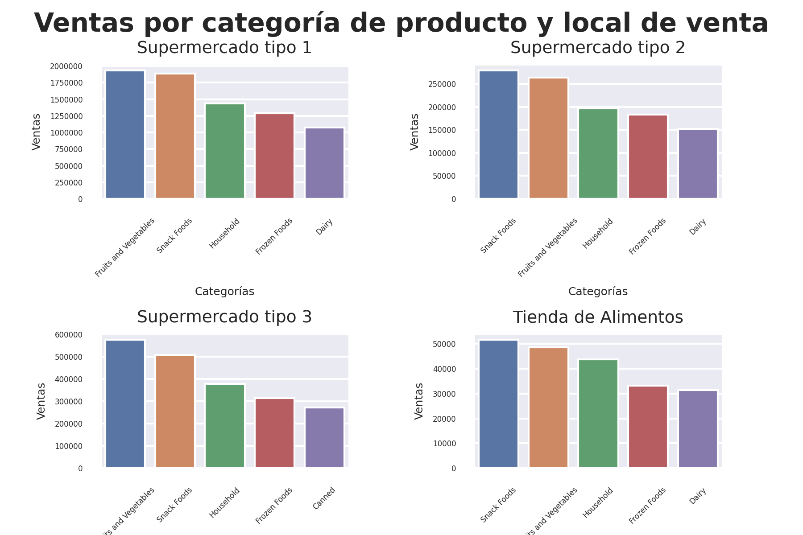

# Predicciones de ventas
Este trabajo trata de un análisis de diversos productos de una cadena de supermercados y sus respectivos niveles de venta para cada tienda. Se tienen las ID de los productos, sus precios unitarios, categorías, claificación según contenido de grasas y visibilidad en góndolas. Además, para cada producto se dan detalles de la tienda donde está en venta, como el ID de la tienda, su tamaño, año de estableciemiento, locación, tipo de tienda y finalmente, el nivel de ventas de cada producto para esa tienda específica.
El dataset contiene valores nulos en dos columnas, "item_weight" y "outlet_size". Para completar estos valores nulos, se relacionaron estas columnas con otras del dataset y se pudieron rellenar casi todos los valores nulos, salvo 4 en "item_weight", por lo que estos registros fueron eliminados.

Luego de limpiar el dataset de valores nulos y duplicados, se puede comenzar a trabajar. 
Para empezar, se hacen algunas visualizaciones para entender algunas características del dataset.
## Visualizaciones

El tipo de local Supermercado tipo 1 es el que más ventas obtiene, seguido por el Supermercado tipo 3.

El tipo de local Supermercado tipo 1 supera ampliamente al resto. Se puede concluir que este tipo de local es el más grande, pues cuenta con un catálogo de productos más grande y más caro.

Al comparar productos "Low Fat" vs "Regular, se puede ver que en el catálogo de productos hay más presencia de productos "Low Fat“. Además, estos últimos también tienen mayor visibilidad en las góndolas.

En el gráfico podemos ver que en los cuatro tipos de locales se mantienen como las categorías con más ventas Frutas y verduras, y Snacks, alternando el primer y segundo lugar. Mientras que en tercer y cuarto lugar, se repiten siempre Productos para la limpieza y mantención del hogar y Alimentos congelados, respectivamente. Finalmente, en quinto lugar aparece Lácteos en casi todos los tipos de locales, salvo en Supermercado tipo 3, donde la categoría es desplazada por Conservas.
## Modelos
Para esta última parte, se pasaron a valores numéricos las columnas "item_fat_content“, "outlet_size“, "outlet_location_type“, "outlet_type“ y "item_type“.

Para este modelo no se consideraron las columnas "item_identifier", "outlet_identifier", "outlet_establishment_year“.
Se separan los datos en 70% para entrenamiento, 15% para testeo y 15% para validación, ya que se realizará optimización. Se obtiene un R2 de 45% y un RMSE de 1222.02. Estos resultados indican que el modelo no tiene mucha utilidad.

